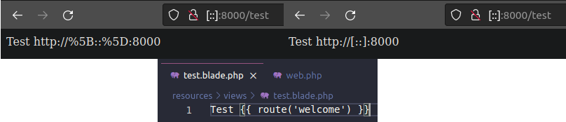

<h1 align="center">Laravel IPv6 Patch</h1>

Fix route helper when using IPv6 to access your Laravel application.
https://github.com/laravel/framework/issues/46315



## Installation

You can install the package via Composer:

```bash
composer require murilochianfa/laravel-ipv6-patch
```

### Dependencies

- *Laravel 10.0 or higher.*
- *PHP 8.2 or higher.*

## Commitment to Quality
During package development, try as best as possible to embrace good design and
development practices to try to ensure that this package is as good as it can
be. The checklist for package development includes:

-   ✅ Be fully PSR1 and PSR4 compliant.
-   ✅ Have no PHPCS warnings throughout all code.
-   ✅ Include comprehensive documentation in README.md.

### Testing

``` bash
composer style
```

### Security

If you discover any security related issues, please email murilo.chianfa@outlook.com instead of using the issue tracker.

## Credits

- [Murilo Chianfa](https://github.com/MuriloChianfa)
- [All Contributors](../../contributors)

## License

The MIT License (MIT). Please see [License File](LICENSE.md) for more information.
